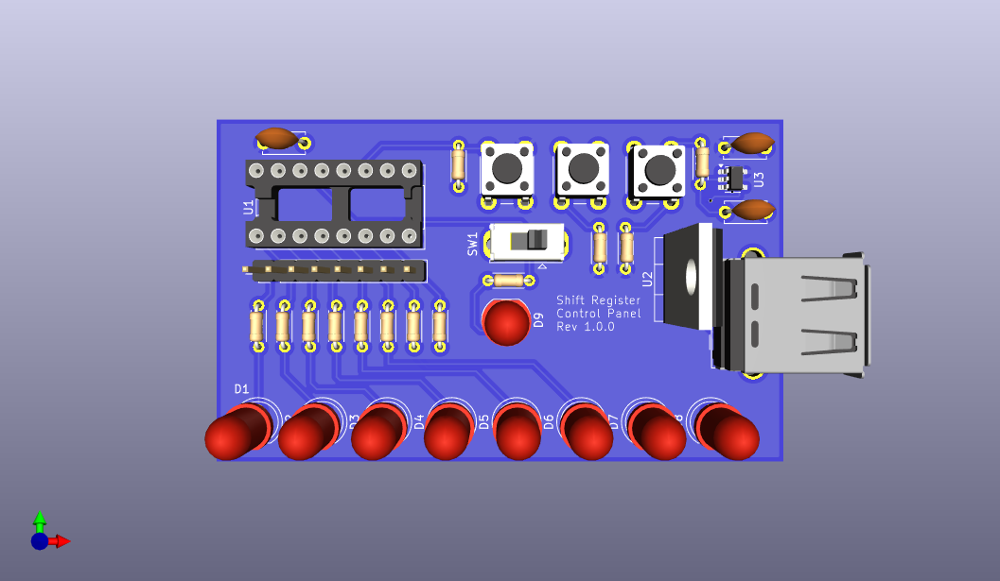

# Shift Register Control Panel

The schematic is [available here](./assets/shift-register-control-panel.pdf). To order a PCB, download this project, and create a zip archive of the `gerbers` directory. Upload this archive to the PCB service when prompted.

## Bill of Materials

All packages are through-hole. 

| Name                   | Quantity | Value         | Purpose                               |
| ---------------------- | -------- | ------------- | ------------------------------------- |
| Capacitor              | 1        | 0.1 uF        | Input voltage smoothing               |
| 5 mm LED               | 9        | Red           | Output display (8), input display (1) |
| Resistor               | 9        | 333 Ω         | LEDs                                  |
| Resistor               | 3        | 10 kΩ         | Pull-up/pull-down                     |
| Header Pins            | 1        | 1x08, 2.54 mm | Carry signal out                      |
| Push Button            | 3        | N/A           | Functions (display, clear, shift)     |
| Slide Switch           | 1        | N/A           | Input                                 |
| LM7805 (T0220 Package) | 1        | N/A           | Voltage regulator                     |
| 16-pin DIP Socket      | 1        | N/A           | Holding shift register chip           |
| 74HC595                | 1        | N/A           | 8-bit SIPO Shift Register Chip        |
